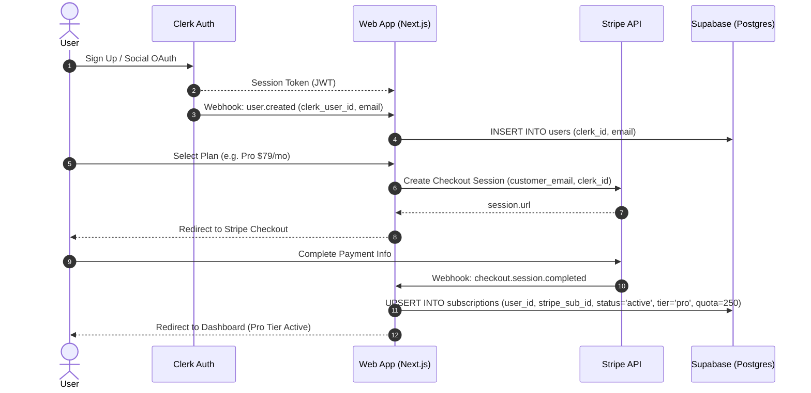
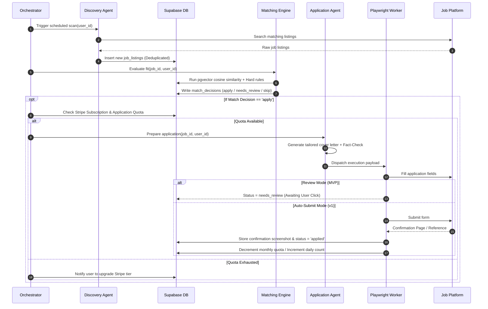

# System Architecture: AI Job Hunt Agents SaaS Platform

**Version:** 1.0 (Draft) | **Companion to:** PRD.md, TRD.md, SYSTEM-DESIGN.md, LOW-LEVEL-SYSTEM-DESIGN.md | **Status:** For Review

---

## 1. End-to-End System Context

```
                         ┌─────────────────────────────────────────┐
                         │               Job Seeker                │
                         │       (Browser: React + Vite SPA)       │
                         └───────────┬─────────────────┬───────────┘
                                     │                 │
                           Auth Flow │                 │ Checkout & Portal
                                     ▼                 ▼
                         ┌───────────────────┐ ┌───────────────────┐
                         │    Clerk Auth     │ │  Stripe Billing   │
                         │ (OAuth, MFA, JWT) │ │(Subscriptions,    │
                         └───────────┬───────┘ │ Checkout, Portal) │
                                     │         └─────────┬─────────┘
                    Clerk Webhooks / │                   │ Stripe Webhooks
                        JWT Claims   │                   │ (Events)
                                     ▼                   ▼
                         ┌─────────────────────────────────────────┐
                         │         API Gateway & Backend           │
                         │      (Node.js Express / Fastify)        │
                         └───────┬─────────────────────────┬───────┘
                                 │                         │
                     RLS Queries │                         │ Dispatches Tasks
                     & Storage   │                         │
                                 ▼                         ▼
            ┌────────────────────────────────────┐ ┌───────────────────────────────┐
            │         Supabase Backend           │ │   Orchestrator & Job Queue    │
            │ - PostgreSQL with RLS (Multi-Tenant│ │   (Temporal / Celery + Redis) │
            │ - pgvector (Semantic Embeddings)   │ └───────────────┬───────────────┘
            │ - Storage (Resumes, Screenshots)   │                 │
            │ - Realtime (Live Dashboard Feed)   │                 │ Launches Ephemeral
            └────────────────────────────────────┘                 ▼
                                                   ┌───────────────────────────────┐
                                                   │  Browser Automation Worker    │
                                                   │  Pool (Playwright Sandboxes)  │
                                                   └───────────────┬───────────────┘
                                                                   │
                                                      Submits To   ▼
                                                   ┌───────────────────────────────┐
                                                   │    External Job Platforms     │
                                                   │  (LinkedIn, Indeed, Lever,    │
                                                   │   Greenhouse, Workday)        │
                                                   └───────────────────────────────┘
```

---

## 2. Layered SaaS Architecture

### 2.1 Client Layer (Frontend)
- **Framework:** **React + Vite + TypeScript + Tailwind CSS**.
- **Routing:** `react-router-dom` for declarative client-side route layouts and protected views.
- **Authentication Components:** `@clerk/clerk-react` (`<SignIn />`, `<SignUp />`, `<UserButton />`, session hooks).
- **Billing Components:** Stripe Pricing Table, embedded checkout redirects, and Stripe Customer Billing Portal triggers (`@stripe/stripe-js`).
- **Data Integration:** Supabase Client (`@supabase/supabase-js`) with Clerk JWT for direct secure client-side RLS reads and Realtime subscriptions.

### 2.2 Identity & Multi-Tenancy Layer (Clerk)
- **Identity Provider (IdP):** Manages user sign-ups, social logins (Google, GitHub, LinkedIn), and session tokens.
- **Clerk Webhooks:** Emits `user.created`, `user.updated`, and `user.deleted` events to the backend to maintain synchronized records in Supabase `users` table.
- **Supabase Integration:** Clerk JWT is passed to Supabase so that PostgreSQL Row-Level Security (RLS) policies evaluate `auth.jwt() ->> 'sub'` to guarantee complete multi-tenant data isolation.

### 2.3 Payments & Billing Engine (Stripe)
- **Stripe Checkout:** Handles subscription creation across Free Trial, Starter ($29/mo), and Pro ($79/mo) plans.
- **Stripe Customer Portal:** Allows self-service payment method updates, tier upgrades/downgrades, and cancellation.
- **Stripe Webhooks Worker:** Verifies webhook signatures (`stripe-signature`) and securely updates subscription records, invoice history, and quota allotments in Supabase.
- **Quota Enforcer:** Validates daily and monthly application balances before any discovery matching task is allowed to transition to execution.

### 2.4 Data, Vector & Storage Layer (Supabase)
- **PostgreSQL Database:** Primary persistent store for users, profiles, jobs, match decisions, applications, activity logs, and subscriptions.
- **Row-Level Security (RLS):** Strict table-level policies ensuring tenant data privacy.
- **`pgvector` Extension:** Stores 1536-dimensional OpenAI/Claude text embeddings for semantic similarity scoring between candidate profiles and job listings.
- **Supabase Storage:**
  - `resumes/`: Private bucket for original and tailored PDF/DOCX resumes.
  - `audit-artifacts/`: Submission confirmation screenshots and proof artifacts.
- **Supabase Realtime:** Broadcasts database events (`applications`, `activity_log`, `quota`) directly to client websockets for live dashboard feeds.

### 2.5 Multi-Agent AI & Orchestration Engine
- **Profile Parsing Agent:** Extracts structured JSON and generates semantic embeddings upon resume upload.
- **Discovery Agent:** Executes scheduled search queries per platform connector, normalizing listings and computing deduplication hashes.
- **Matching Agent:** Evaluates hard rules (blacklist, salary, location), calculates `pgvector` cosine similarity, and triggers LLM judgment on borderline matches.
- **Application Agent:** Generates tailored cover letters and resume summaries, verifies all claims via an automated Fact-Checker pass against profile data, and maps form fields.
- **Orchestrator:** Durable workflow manager (Temporal or Celery + Redis) managing state persistence, retries, and rate limits.

### 2.6 Worker Pool & Platform Connectors
- **Playwright Worker Sandboxes:** Ephemeral, isolated containers executing form filling and submission without shared memory or disk.
- **Safety & Blocker Detection:** Detects CAPTCHA, Cloudflare challenges, or expired logins; automatically pauses execution and triggers user review without attempting bypasses.
- **Platform Connectors:** Modular adapters implementing a uniform interface (`PlatformConnector`) for LinkedIn, Greenhouse, Lever, Workday, etc.

---

## 3. Sequence Flows

### 3.1 User Sign-Up & Stripe Subscription Lifecycle


### 3.2 Discovery, Tiered Matching & Execution Flow


---

## 4. Multi-Tenant Security & Isolation Model

```
                    ┌──────────────────────────────────────────────┐
                    │               Incoming Request               │
                    │      Authorization: Bearer <Clerk_JWT>       │
                    └──────────────────────┬───────────────────────┘
                                           │
                                           ▼
                    ┌──────────────────────────────────────────────┐
                    │              Clerk Middleware                │
                    │   - Validates JWT signature & expiry         │
                    │   - Extracts `sub` (Clerk User ID)           │
                    └──────────────────────┬───────────────────────┘
                                           │
                                           ▼
                    ┌──────────────────────────────────────────────┐
                    │            Supabase Database Client          │
                    │   - Sets request header or claims:           │
                    │     `request.jwt.claim.sub` = clerk_id       │
                    └──────────────────────┬───────────────────────┘
                                           │
                                           ▼
 ┌───────────────────────────────────────────────────────────────────────────────────┐
 │                            PostgreSQL Tables with RLS                             │
 │                                                                                   │
 │   CREATE POLICY "User Data Isolation" ON profiles                                 │
 │   FOR ALL USING (user_id = (SELECT id FROM users WHERE clerk_id = auth.jwt()->>'sub'));│
 └───────────────────────────────────────────────────────────────────────────────────┘
```

1. **Row-Level Security:** Enforced natively in PostgreSQL. Even in the event of an application logic bug, a user cannot query another user's profile, applications, credentials, or logs.
2. **KMS / Secret Management:** Job site credentials stored in `platform_credentials` are encrypted with AES-256-GCM using encryption keys stored in a managed KMS.
3. **Stripe PCI Compliance:** Zero cardholder data stored on Supabase or platform servers.