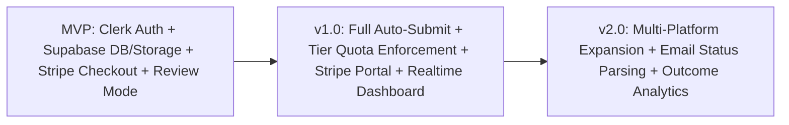

# Product Requirements Document (PRD): AI Job Hunt Agents SaaS Platform

**Version:** 1.0 (Draft) | **Status:** For Review | **Target:** SaaS Multi-Tenant Platform

---

## 1. Executive Summary & Vision

### 1.1 Objective
Build a commercial, multi-tenant **SaaS platform** powered by autonomous AI agents that automates the end-to-end job discovery and application workflow for job seekers. Users authenticate via **Clerk**, subscribe to tailored plans via **Stripe**, and manage their profiles, documents, and application pipelines securely in **Supabase**.

### 1.2 Vision Statement
> *"Give the AI agent your resume, preferences, and guidelines once. The SaaS platform continuously discovers relevant jobs, matches skills, writes tailored applications, executes submissions automatically, and tracks status—freeing job seekers from hundreds of hours of manual, repetitive work."*

---

## 2. Target Users & SaaS Monetization Strategy

### 2.1 Target Personas
1. **Active Job Seekers & Recent Grads:** High-volume application needs, looking for entry-to-mid roles across multiple platforms.
2. **Busy Working Professionals:** Passive seekers with limited hours who need hyper-targeted, high-fit applications.
3. **Contract / Tech Freelancers:** Continuous search for rolling contracts and gig engagements.

### 2.2 Subscription Tiers (Stripe Integration)

| Tier | Price (Monthly / Annual) | Application Quota | Discovery & Features | Support & Add-ons |
| :--- | :--- | :--- | :--- | :--- |
| **Free / Trial** | $0 (7-day trial) | 5 applications total | 1 job platform, Review-Mode only, Standard speed | Community Support |
| **Starter** | $29 / mo | 50 applications / mo (Max 5/day) | 2 platforms, Review & Auto modes, Standard AI matching | Email Support |
| **Pro (Popular)** | $79 / mo | 250 applications / mo (Max 15/day) | All supported platforms, Full Auto-Submit, Priority Queues, Custom Cover Letters & Resumes | Priority Email & Discord |
| **Power / Executive** | $149 / mo | Unlimited (Fair use: 50/day) | Dedicated worker pool, Email status parsing, Instant discovery scans, Dedicated IP sandboxes | 1-on-1 Onboarding & Support |

---

## 3. Core Architectural & SaaS Stack

| Pillar | Service | Role in Platform |
| :--- | :--- | :--- |
| **Authentication & Users** | **Clerk** | User signup/login, Google/GitHub/LinkedIn SSO, MFA, JWT generation, User metadata & session management. |
| **Backend & Database** | **Supabase** | Multi-tenant PostgreSQL database with **Row-Level Security (RLS)**, `pgvector` for embedding similarity, Supabase Storage for resumes and audit artifacts, Realtime subscriptions for live dashboard updates. |
| **Payments & Subscriptions** | **Stripe** | Stripe Checkout, Customer Billing Portal, Webhook synchronization (`checkout.session.completed`, `customer.subscription.updated`, `invoice.payment_succeeded`), usage metering and quota enforcement. |
| **AI & Agent Orchestration** | **LLM & Worker Pool** | Resume extraction, semantic vector search, LLM-based structured judgment, grounded cover letter generation, fact-check validator, Playwright sandboxed browser workers. |

---

## 4. User Journey & Core Features

### 4.1 Onboarding & Authentication (Clerk)
- **Sign-Up / Sign-In:** Frictionless social auth (Google, GitHub, LinkedIn) or magic links via Clerk.
- **User Sync Webhook:** Clerk webhooks (`user.created`, `user.updated`) automatically provision and synchronize user records in Supabase `users` table.

### 4.2 Subscription & Billing Flow (Stripe)
- **Plan Selection:** Integrated pricing table directing users to Stripe Checkout.
- **Customer Portal:** Self-service Stripe Customer Portal allowing users to upgrade, downgrade, update payment methods, or cancel subscriptions.
- **Quota Enforcer:** Real-time quota check in Supabase before queuing or executing any application task.

### 4.3 Profile & Resume Ingestion (Supabase Storage + LLM)
- Upload resume (PDF / DOCX) directly to Supabase Storage with signed secure URLs.
- Background worker parses skills, experience, education, projects, and generates a structured profile.
- Embedding generated and stored in Supabase `profiles.embedding` using `pgvector`.
- Review & edit screen allowing user to adjust preferences, minimum salary, locations, blacklisted companies, and custom screening Q&A answers.

### 4.4 Continuous Job Discovery & Normalization
- Scheduled discovery workers run per user/platform according to subscription tier frequency.
- Listings normalized and deduplicated across platforms via SHA-256 content hashing.

### 4.5 Intelligent Tiered Matching
- **Tier 0 (Hard Rules):** Immediate filter by blacklist, minimum compensation, location preference, and work authorization.
- **Tier 1 (pgvector Semantic Search):** Cosine distance comparison between profile embedding and job listing embedding.
- **Tier 2 (LLM Structured Judgment):** Deep evaluation on borderline cases providing structured score and plain-text reasoning.

### 4.6 Fact-Checked Application Generation
- Generates tailored cover letters and resume summaries grounded strictly in user's profile data.
- **Fact-Check Pass:** LLM validator checks every claim against user profile to prevent hallucinations and unverified claims.

### 4.7 Form Filling & Submission Execution
- **Review-Mode (Default):** Prepares form payload and notifies user for one-click approval on the dashboard.
- **Auto-Mode:** Automatically fills forms and submits through sandboxed Playwright browser workers or direct API where permitted.
- **Safety Gate:** Immediate pause upon detecting CAPTCHAs, expired session tokens, or unanswerable screening questions without attempting evasive bypasses.

### 4.8 Tracking, History & Audit Log
- Capture confirmation reference, status timestamps, and screenshot artifact in Supabase Storage.
- Real-time updates via Supabase Realtime to user's dashboard.
- Full immutable event audit trail stored in `activity_log`.

---

## 5. Security, Privacy & SaaS Compliance

| Area | Implementation |
| :--- | :--- |
| **Multi-Tenancy & Data Isolation** | Enforced via Supabase Row-Level Security (RLS) using Clerk JWT user ID (`auth.jwt() ->> 'sub'`). |
| **Payment Security** | Zero credit card data stored locally; 100% handled via Stripe PCI-DSS Level 1 compliant infrastructure. |
| **Platform Credentials & Secrets** | User job-site session tokens encrypted at rest via AES-GCM / KMS; decrypted only in memory within isolated worker containers. |
| **Bot Policy & Terms of Service** | Strictly respects site terms and rate limits; official APIs preferred; no CAPTCHA breaking or evasion. |
| **GDPR / Privacy Compliance** | Right-to-erasure endpoint to purge user profile, logs, and storage assets in Supabase with one click. |

---

## 6. Success Metrics & KPIs
- **Monthly Recurring Revenue (MRR) & ARR:** Growth across Starter, Pro, and Power tiers.
- **Conversion Rate:** Trial/Free to Paid subscription conversions via Stripe.
- **Application Submission Success Rate:** $\ge 95\%$ successful completions without unexpected worker crashes.
- **Time Saved per User:** Measuring hours saved compared to manual job applications (~15–20 hours/month per active user).
- **Match Precision:** User ratings and interview callback rates per 100 submitted applications.

---

## 7. Phased Product Milestones

1. **MVP:** Clerk Auth, Supabase DB & Storage, Stripe Checkout (Starter & Pro), Resume parsing, Job discovery (1–2 platforms), Review-before-submit mode, Activity logging.
2. **v1.0:** Full Auto-Submit mode, Stripe Customer Portal & Webhook sync, Tier-based daily/monthly application quotas, Supabase Realtime alerts, Playwright worker autoscaling.
3. **v2.0:** Multi-platform expansion, consent-based email status parsing, AI application performance analytics, dynamic matching weight optimization.