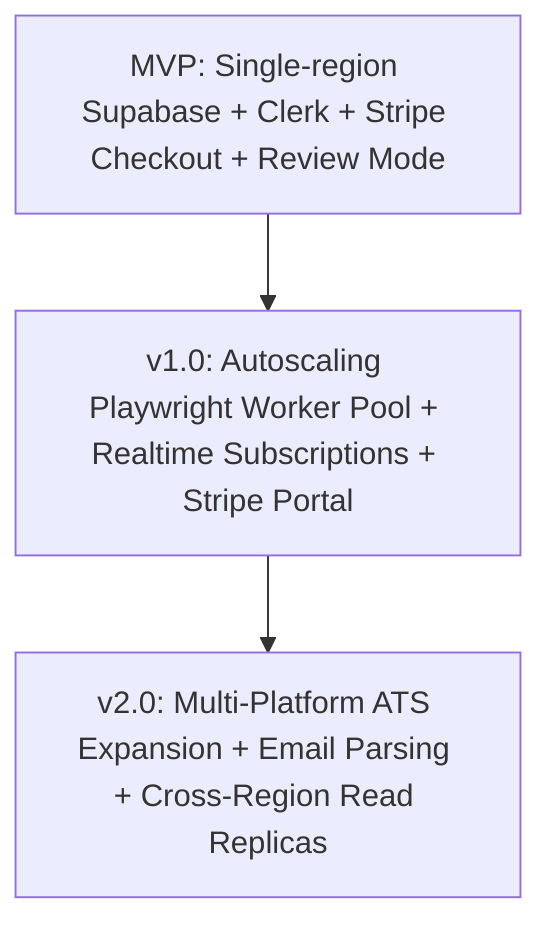

# System Design: AI Job Hunt Agents SaaS Platform

**Version:** 1.0 (Draft) | **Companion to:** PRD.md, TRD.md, ARCHITECTURE.md, LOW-LEVEL-SYSTEM-DESIGN.md | **Status:** For Review

---

## 1. System Overview & Core Requirements

This document details the architectural and engineering rationale for the **AI Job Hunt Agents SaaS Platform**. The platform is designed as a secure, scalable multi-tenant SaaS utilizing:
- **Clerk:** For identity management, authentication, and SSO.
- **Stripe:** For recurring billing, subscription lifecycle, and tier quota enforcement.
- **Supabase:** For primary PostgreSQL storage with Row-Level Security (RLS), `pgvector` semantic matching, and Supabase Storage.
- **Agent Orchestrator & Worker Pool:** For autonomous multi-agent job discovery, fact-checked application generation, and sandboxed Playwright submission.

### Core Design Drivers
1. **Multi-Tenant Data Privacy:** Strict tenant isolation via Supabase RLS policies tied to Clerk JWTs.
2. **Entitlement & Quota Integrity:** Guaranteed synchronization between Stripe subscription events and application quotas.
3. **Auditability & Fact-Checking:** Every decision, match reasoning, filled field, and generated document is verifiable and immutable.
4. **Resilient Long-Running Workflows:** Asynchronous jobs that can safely pause for days (review mode / human solve) without holding compute.
5. **Ethical Automation & Rate Compliance:** Strict adherence to platform rate limits; no CAPTCHA-bypassing or evasion techniques.

---

## 2. Capacity & Scale Estimation (Back-of-Envelope)

### 2.1 User Cohort & Subscription Assumptions

| Parameter | Starter Tier (60%) | Pro Tier (35%) | Power Tier (5%) | Total / Aggregate |
| :--- | :--- | :--- | :--- | :--- |
| **Active Subscribed Users** | 6,000 | 3,500 | 500 | **10,000 Users** |
| **Daily Application Cap** | 5 apps/day | 15 apps/day | 50 apps/day | — |
| **Max Daily Applications** | 30,000 | 52,500 | 25,000 | **~107,500 apps/day** |
| **Discovery Scan Frequency** | Every 6 hours (4/day) | Every 3 hours (8/day) | Every 1 hour (24/day) | **~64,000 scans/day** |

### 2.2 System Throughput & Workload Analysis
- **Discovery Load:** 64,000 scans/day $\approx 0.74\text{ scans/sec}$ (bursty during morning windows). Approximately 1.5M raw listings ingested daily. Cross-user deduplication reduces unique listings stored in Supabase by 10–30x.
- **Vector & Match Evaluations:** ~1.5M match evaluations/day $\approx 17\text{ evaluations/sec}$ average, peaking at ~50–80/sec. Fast `pgvector` HNSW indexes allow sub-50ms vector queries.
- **Playwright Execution Load:** ~100,000 application attempts/day. Each browser session takes 45–90s. At a peak rate of 10 applications/sec, the system requires ~450–900 concurrent Playwright sandboxes. This makes the **worker container pool the primary compute cost driver**, not the database or API.
- **Storage & Artifacts:**
  - `resumes/`: 10,000 users $\times$ 2 MB $\approx 20\text{ GB}$.
  - `audit-artifacts/` (Screenshots): 100,000 submissions/day $\times$ 500 KB $\approx 50\text{ GB/day}$. A 90-day lifecycle rule in Supabase Storage moves older screenshots to cold archive.

---

## 3. Deep Dives into Core Architectural Subsystems

### 3.1 Deep Dive: Multi-Tenancy with Supabase RLS & Clerk
```
Clerk Auth (User logs in) 
   ──► Issues JWT (Contains `sub`: "user_2aBc...")
   ──► Client passes JWT to Supabase client
   ──► Supabase extracts `auth.jwt() ->> 'sub'`
   ──► PostgreSQL RLS filters: `WHERE clerk_id = auth.jwt() ->> 'sub'`
```
- **Why this approach:** Decouples user auth management (handled entirely by Clerk) while maintaining database-level tenant isolation directly inside PostgreSQL. Even if a bug exists in the backend API layer, the database engine prohibits cross-tenant data leaks.
- **User Provisioning:** Clerk Webhook (`user.created`) automatically calls the Supabase service role to insert the corresponding row into `public.users(clerk_id, email)`.

### 3.2 Deep Dive: Stripe Subscriptions & Quota Enforcement
- **Event-Driven Billing:** Stripe is the sole source of truth for payment status.
- **Webhook Resiliency:**
  - Webhooks from Stripe (`checkout.session.completed`, `customer.subscription.updated`, `customer.subscription.deleted`, `invoice.payment_succeeded`) are processed idempotently by tracking `event_id` in a `processed_stripe_events` table.
  - Updates `subscriptions` in Supabase with `status`, `plan_id`, `current_period_end`, and resets monthly application allowances.
- **Pre-Execution Quota Gate:**
  ```sql
  -- Atomic balance check before enqueuing an application
  UPDATE subscriptions
  SET monthly_applications_used = monthly_applications_used + 1,
      daily_applications_used = daily_applications_used + 1
  WHERE user_id = $1 
    AND status = 'active'
    AND monthly_applications_used < monthly_quota
    AND daily_applications_used < daily_cap
  RETURNING id;
  ```
  If no row is updated, the task is immediately held and the user is prompted to upgrade their plan via Stripe Customer Portal.

### 3.3 Deep Dive: Cost-Optimized Tiered Matching Engine
Calling LLMs for 1.5M listings daily would cost thousands of dollars per day. The tiered matching engine solves this:
1. **Tier 0 (Deterministic Rules - 0ms, Free):** Hard filters (blacklisted companies, minimum salary, remote/location mismatch, missing visa authorization). Eliminates 70–80% of irrelevant jobs.
2. **Tier 1 (pgvector Semantic Search - <20ms, Cheap):** Cosine distance between profile embedding and job listing embedding. If similarity $< 0.65$, skip immediately.
3. **Tier 2 (LLM Structured Judgment - ~1s, Selective):** Invoked only for borderline matches (score between 0.65 and 0.82) to perform nuanced evaluation with structured output and explanation. High-confidence matches ($\ge 0.82$) proceed directly with templated reasoning.

### 3.4 Deep Dive: Durable Pausable Workflows & Sandbox Isolation
- **Durable Pause/Resume:** Workflows in Review Mode or paused on CAPTCHA detection utilize Temporal-style signal waits or persisted state machines. Compute resources (Playwright containers) are released during the pause.
- **Ephemeral Sandboxing:** Each Playwright browser worker runs inside an isolated container with its own browser profile, temporary directory, and proxy IP allocation. Memory is purged immediately on task completion.

---

## 4. Bottleneck Analysis & Mitigations

| Subsystem Bottleneck | Risk / Root Cause | Engineered Mitigation |
| :--- | :--- | :--- |
| **Playwright Worker Concurrency** | Resource-heavy container sessions (CPU/RAM spikes during burst windows) | Horizontal worker autoscaling based on queue depth; ephemeral container lifecycles; centralized concurrency caps per platform. |
| **LLM Token Costs & Latency** | High-volume content generation during peak hours | Tiered matching (§3.3); structured prompt caching; LLM fact-checker pass restricted to diff claims. |
| **Stripe Webhook Delivery Delays** | Network hiccups or downstream API latency delaying subscription activation | Idempotent webhook receiver queue; optimistic UI state with server-side validation. |
| **Platform-Side Rate Limiting** | Target job boards banning accounts due to rapid consecutive requests | Centralized token bucket rate limiter per platform in Orchestrator; randomized human-like delays; strict adherence to rate limits. |
| **Supabase `pgvector` Scale** | Growing vector index degrading search latency over time | HNSW indexing with tuned `m` and `ef_construction` parameters; automated archival of stale listings $> 60$ days old. |

---

## 5. Scaling & Evolution Roadmap



1. **Launch Phase (MVP):** Single-region Supabase managed instance, Clerk Auth, Stripe Checkout, 1–2 platform connectors, Review-Mode application gate.
2. **Scale Phase (v1.0):** Autoscaled Playwright worker cluster on Kubernetes/ECS, Supabase Realtime dashboard, self-service Stripe Customer Portal, full Auto-Submit mode.
3. **Maturity Phase (v2.0):** Dedicated ATS platform connectors (Greenhouse, Lever, Workday), optional email parsing for status updates, AI-driven outcome analytics.