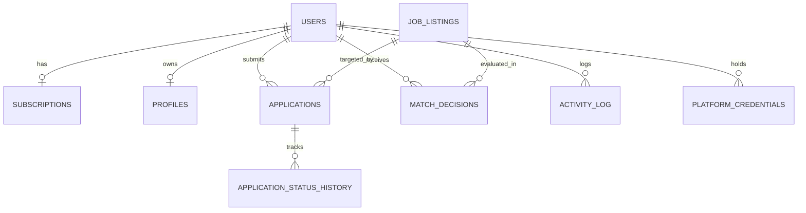

# Technical Requirements Document (TRD): AI Job Hunt Agents SaaS Platform

**Version:** 1.0 (Draft) | **Companion to:** PRD.md, ARCHITECTURE.md, SYSTEM-DESIGN.md, LOW-LEVEL-SYSTEM-DESIGN.md | **Status:** For Review

---

## 1. Technical Purpose & Engineering Principles

This document defines the complete technical implementation requirements for the **AI Job Hunt Agents SaaS Platform**. The platform provides an autonomous multi-agent job application service within a commercial, multi-tenant SaaS architecture.

### Key Engineering Principles
1. **Separation of Concerns:** Clerk manages identity, Stripe manages subscriptions and invoicing, Supabase manages relational data, vectors, storage, and RLS tenant boundaries.
2. **Defensive AI Engineering:** Generated application content is strictly bounded by user-verified data with an automated fact-checking pass; no hallucinations permitted.
3. **Tenant Data Isolation:** Enforce isolation at the database layer via PostgreSQL Row-Level Security (RLS) driven by Clerk JWTs.
4. **Ethical Automation:** Adhere to job board rate limits; official APIs are preferred; no CAPTCHA-bypassing or fingerprint spoofing.

---

## 2. Production Technology Stack

| Layer | Technology Choice | Architectural Rationale |
| :--- | :--- | :--- |
| **Frontend Framework** | **Next.js 14+ (App Router) / React + TS** | Server-side rendering (SSR), API route handlers, responsive modern UI, seamless Clerk & Supabase SDK support. |
| **Authentication & Users** | **Clerk (`@clerk/nextjs`)** | Turnkey social logins (Google, GitHub, LinkedIn), MFA, JWT session claims, webhooks for user lifecycle syncing. |
| **Primary Database & RLS** | **Supabase (PostgreSQL 15+)** | Multi-tenant relational schema with native Row-Level Security, JSONB support for flexible profile fields. |
| **Vector Similarity Store** | **Supabase `pgvector`** | Integrated cosine similarity search between resume and job description embeddings (1536 dims). |
| **Object Storage** | **Supabase Storage** | S3-compatible private buckets for resumes (`resumes/`) and audit proof artifacts (`audit-artifacts/`). |
| **Realtime Updates** | **Supabase Realtime** | WebSocket subscriptions for live dashboard status feeds and quota counters. |
| **Billing & Monetization** | **Stripe (Node.js SDK & Webhooks)** | Stripe Checkout, Customer Billing Portal, subscription lifecycle management, and quota enforcement. |
| **AI Orchestration & LLMs** | **Claude 3.5 Sonnet / OpenAI GPT-4o** | Resume parsing, structured match evaluation, job-tailored cover letter generation, fact-check validator. |
| **Browser Automation** | **Playwright (Python / Node.js)** | Ephemeral sandboxed browser containers for automated form-filling and submission verification. |
| **Task Queue / Workflows** | **Temporal / Celery + Redis** | Resilient long-running workflows capable of durable multi-day pauses for review-mode approval and CAPTCHA resolution. |
| **Secrets & Encryption** | **Cloud KMS / AES-256-GCM** | Third-party platform cookies and access tokens encrypted at rest. |

---

## 3. Data Model & Entity Relationships

### 3.1 Entity Overview
- **`users`:** Synchronized from Clerk (`clerk_id`, `email`, `status`).
- **`subscriptions`:** Synchronized from Stripe (`stripe_customer_id`, `stripe_subscription_id`, `plan_tier`, `monthly_quota`, `monthly_applications_used`, `status`).
- **`profiles`:** Parsed resume JSON, search preferences, blacklist rules, screening answers, and `pgvector` embedding.
- **`job_listings`:** Discovered listings across LinkedIn, Greenhouse, Lever, etc., deduplicated via `dedup_hash` and indexed with `pgvector`.
- **`match_decisions`:** Detailed scoring breakdown (skills, salary, location, LLM judgment) and reasoning text.
- **`applications`:** Application state machine, submitted payloads, confirmation references, and Supabase Storage screenshot URLs.
- **`activity_log`:** Append-only audit trail of every search, match, field filled, and error event.

---

## 4. End-to-End SaaS Workflows

### 4.1 Onboarding & Billing Lifecycle
1. **User Sign Up:** User registers via Clerk (Google, LinkedIn, or Email). Clerk webhook triggers creation of record in Supabase `users`.
2. **Plan Activation:** User selects Starter ($29/mo) or Pro ($79/mo) on Stripe Checkout. Stripe webhook updates `subscriptions` with quota allotments.
3. **Resume Ingestion:** User uploads resume (PDF/DOCX) to Supabase Storage. Worker parses text, extracts structured profile JSON, computes `pgvector` embedding, and saves to `profiles`.
4. **Preference Setup:** User configures target job titles, locations, remote preferences, minimum salary, blacklisted companies, and screening answers.

### 4.2 Discovery & Tiered Matching Workflow
1. **Scheduled Scan:** Orchestrator triggers discovery connectors per platform at intervals dictated by subscription tier.
2. **Normalization & Dedup:** Listings are normalized and SHA-256 hashed. New listings are inserted into Supabase `job_listings`.
3. **Tiered Matching:**
   - *Tier 0:* Blacklist, salary floor, and location filters reject unsuitable jobs instantly.
   - *Tier 1:* `pgvector` cosine similarity score computed against candidate profile embedding.
   - *Tier 2:* Borderline scores trigger an LLM structured evaluation.
4. **Decision Persistence:** Result saved to `match_decisions`. If score $\ge$ threshold, task is queued for application.

### 4.3 Quota Check & Application Execution
1. **Quota Gate:** System checks `subscriptions` table in Supabase. If `monthly_applications_used < monthly_quota` and subscription is `active`, quota is decremented and execution proceeds.
2. **Content Generation:** Tailored cover letter and resume summary generated and verified via automated fact-checking pass.
3. **Execution Mode:**
   - **Review Mode (MVP):** Application saved as `needs_review`; user alerted on dashboard for one-click approval.
   - **Auto-Submit Mode (v1.0):** Sandboxed Playwright container launches, fills form fields, submits application, captures screenshot to Supabase Storage, and marks status as `applied`.
4. **Safety Interception:** If a CAPTCHA, Cloudflare challenge, or unmapped screening question is detected, worker immediately pauses and notifies user without attempting bypasses.

---

## 5. Security, Multi-Tenancy & Compliance

1. **Row-Level Security (RLS):** Supabase database queries validate Clerk JWT claims (`auth.jwt() ->> 'sub'`). Users cannot access cross-tenant data.
2. **Zero PCI Scope:** All checkout flows and payment method storage are handled strictly via Stripe hosted pages.
3. **KMS Credential Storage:** Job platform cookies/tokens in `platform_credentials` are encrypted with AES-256-GCM.
4. **Sandbox Isolation:** Playwright workers run in ephemeral container sandboxes with isolated browser profiles and memory purged on task exit.
5. **GDPR / DPDP Compliance:** Full account deletion cascade purges all user data, profiles, and Supabase Storage assets on request.