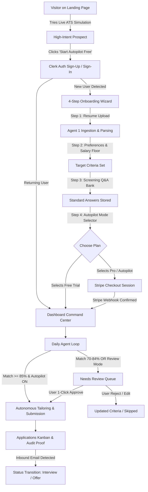
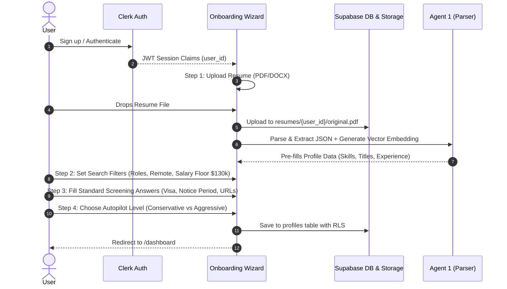

# User Flow & Journey Specification: JobHunt AI

**Version:** 1.0 | **Companion to:** `frontend-design.md`, `architecture.md`, `agents.md`, `ui-rules.md` | **Status:** Approved Specification

---

## 1. Global User Journey Architecture



---

## 2. Granular Step-by-Step User Flows

### Flow 1: Public Discovery & Interactive Simulation (Landing Page)
* **Goal:** Demonstrate immediate value before demanding sign-up ("Show, Don't Tell").
* **Screen:** `/` (Public Landing Page)
* **Steps:**
  1. Visitor lands on hero section with animated GSAP headline.
  2. Visitor enters target role (e.g., *"Staff Frontend Engineer"*) in the interactive simulator card.
  3. UI triggers a lightweight live simulation:
     - Scans 3 simulated tech job listings in 1.2s.
     - Displays ATS compatibility score (e.g., `88% Fit`).
     - Demonstrates a live tailored resume bullet transformation with streaming typewriter effect.
  4. Visitor clicks primary CTA: **"Start Autonomous Job Hunt"**.
  5. System navigates to `/sign-up` preserving attribution parameters.

---

### Flow 2: Authentication & Onboarding Wizard
* **Goal:** Ingest candidate data, configure search criteria, and build the automated answer bank with zero friction.
* **Screens:** `/sign-up`, `/sign-in`, `/onboarding`
* **Pre-condition:** Authenticated via Clerk (Google, GitHub, or Email/Password).



#### Step Validation Gates:
- **Step 1 (Resume):** Must pass PDF/DOCX MIME type validation; parsed skills must be > 3 items.
- **Step 2 (Preferences):** At least 1 target role title and 1 location preference required.
- **Step 3 (Answer Bank):** Work authorization (US / Sponsorship) cannot be empty.
- **Step 4 (Autonomy):** User selects either `Autonomous Autopilot` (auto-submit ≥85%) or `Assisted Pilot` (human review required for all).

---

### Flow 3: Stripe Subscription & Quota Upgrade
* **Goal:** Enable monetization with self-service checkout and plan management.
* **Screens:** `/billing`, Stripe Hosted Checkout, Stripe Customer Portal.
* **Steps:**
  1. User navigates to `/billing` or hits the daily free trial cap (3 applications).
  2. User views pricing matrix:
     - **Free Trial:** 3 applications total.
     - **Pro ($29/mo):** 20 applications/day, hourly scraping, email alerts.
     - **Autopilot ($79/mo):** 50 applications/day, 24/7 autonomous loop, priority browser pool.
  3. User clicks "Upgrade to Autopilot".
  4. Client invokes API route `POST /api/billing/create-checkout`.
  5. Server initializes Stripe Checkout session with `client_reference_id = user_id`.
  6. User completes payment on Stripe.
  7. Stripe sends webhook `checkout.session.completed` to `/api/webhooks/stripe`.
  8. Server updates `public.subscriptions` table in Supabase.
  9. Supabase Realtime updates UI badge from `Free` to `Autopilot ⚡` with zero page refresh.

---

### Flow 4: Command Center Daily Dashboard Operation
* **Goal:** High-density, real-time command center monitoring the autonomous fleet.
* **Screen:** `/dashboard`

```
┌────────────────────────────────────────────────────────────────────────┐
│ [● Agent Running: Autopilot Mode]   [Today's Quota: 24/50]   [PAUSE ⏸] │
├────────────────────────────────────────────────────────────────────────┤
│ [ 142 Jobs Scanned ] [ 28 Matches >=80% ] [ 18 Applied ] [ 4 Intvs ]   │
├──────────────────────────────────────┬─────────────────────────────────┤
│ APPLICATION FUNNEL (Sankey Chart)    │ REAL-TIME AGENT TERMINAL STREAM │
│                                      │ [14:22:01] Scanned Greenhouse...│
│ Discovered (142)                     │ [14:22:04] Match score: 92%    │
│  └─ Matched (28)                     │ [14:22:08] Tailoring PDF...    │
│      └─ Applied (18)                 │ [14:22:15] Submitted ✓ Proof   │
│          └─ Interview (4)            │ [14:22:18] Waiting next batch_ │
├──────────────────────────────────────┴─────────────────────────────────┤
│ PENDING HUMAN REVIEW (3 Jobs Requiring Attention)                      │
│ - Senior Full Stack Engineer @ Stripe (Score: 82% | Verify Salary)     │
│ - Lead Frontend Architect @ Vercel (Score: 89% | Custom Essay Answer)   │
└────────────────────────────────────────────────────────────────────────┘
```

* **Key Interactions:**
  - **Emergency Kill Switch:** Red floating control button pauses all active Playwright workers within 500ms.
  - **Live Terminal Pause-on-Hover:** Allows candidate to inspect agent logs without losing scroll position.
  - **Clickable Funnel Nodes:** Filtering downstream tables by funnel stage.

---

### Flow 5: Human-in-the-Loop Review & Approval Queue
* **Goal:** Safety checkpoint for borderline match scores or non-standard ATS prompts.
* **Screens:** `/dashboard`, `/jobs/[id]`, Slide-over Drawer
* **Steps:**
  1. Agent evaluates job with match score between 70% and 84%, or encounters an un-answered custom question.
  2. Application state enters `needs_review`.
  3. Dashboard badges increment with notification ping.
  4. Candidate opens review drawer:
     - Inspects Job Description & Company Info.
     - Inspects AI Match Score breakdown (Skill overlap 40%, Experience 30%, Semantic fit 30%).
     - Reviews AI-generated custom answer draft (can edit inline).
     - Previews tailored resume PDF.
  5. Candidate clicks **"Approve & Submit Now"** (or **"Skip Job"**).
  6. Job transitions to `queued` ➔ Browser Worker claims task ➔ Submits and captures screenshot.

---

### Flow 6: Interactive Kanban Pipeline & Inbound Status Tracking
* **Goal:** Full visibility into application lifecycles from submission to offer.
* **Screen:** `/applications`
* **Steps:**
  1. Candidate views 6-column Kanban board: `Discovered` ➔ `Matched` ➔ `Queued` ➔ `Applied` ➔ `Interview` ➔ `Archived`.
  2. **Manual Drag & Drop:** User drags card from `Applied` to `Interview`.
     - UI updates optimistically with Framer Motion spring physics.
     - Supabase mutation persists new status.
  3. **Automated Status Update (Email Webhook):**
     - Recruiter replies with interview scheduling link.
     - Postmark/SendGrid inbound email webhook triggers Agent 6.
     - Agent parses intent (`INTERVIEW_INVITATION`).
     - Card automatically glides into `Interview` column with glowing violet highlight.
  4. Candidate clicks card to view **Audit Proof**:
     - Submission timestamp.
     - Full-page Playwright confirmation screenshot.
     - Versioned tailored resume file.
